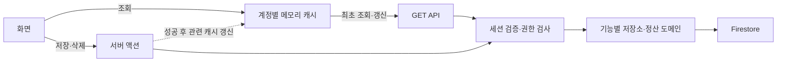

# Data Store

브라우저는 Firestore를 직접 읽거나 수정하지 않습니다. 조회는 GET API, 변경은 기능별 서버 액션을 사용합니다.

- `src/lib/auth/session.ts`: 검증된 Firebase 세션에서 요청자 확인
- `src/lib/services/access.ts`: 그룹·모임별 조회 및 관리 권한
- `src/lib/actions`: 서버 입력 검증과 기능 흐름
- `src/lib/data-store/{users,friends,meetings,meeting-prep,reserve-fund}.ts`: Firebase Admin SDK 저장소
- `src/lib/data-store/shared.ts`: Timestamp → Date 변환과 저장 값 정리

서버에서 `@/lib/data-store`를 사용합니다. 브라우저용 데이터 저장소는 제거했습니다.

모임 목록은 `GET /api/meetings`를 통해 조회합니다. API는 검증한 세션 사용자를 기준으로 기존 서버 액션의 권한·필터 검사를 사용하고 `private, no-store`를 반환합니다. 요청자의 사용자 ID만으로 데이터에 접근할 수 없습니다. 클라이언트는 JSON의 날짜를 복원하고 화면 이동·조건 변경 시 이전 HTTP 요청을 취소합니다.

## 모임 목록

날짜 + 문서 ID로 안정적인 커서 페이지를 조회합니다. 생성자와 접근 가능한 그룹 쿼리 결과를 중복 제거하고 병합합니다. viewer는 명시적으로 할당된 그룹만 조회합니다.

연도 선택은 전체 내역을 읽지 않고, 가장 오래된 날짜와 최신 날짜의 범위에서 제공합니다. 기록이 없는 중간 연도도 선택할 수 있습니다.

기존 문서의 누락된 boolean 필드와 이름 부분 검색은 서버의 제한된 조회 구간에서 필터링합니다. 한 구간에 결과가 없어도 `hasMore`와 `nextCursor`로 다음 구간을 조회할 수 있습니다. 목록은 전체 개수를 계산하지 않습니다.

새 복합 인덱스는 `firestore.indexes.json`에 정의되어 있습니다. 기존 Firebase 프로젝트의 설정과 합친 뒤 배포해야 합니다. 이 저장소 변경은 클라우드 인덱스나 규칙을 자동 배포하지 않습니다.

커서 쿼리의 `dateTime`은 Firestore Timestamp를 기준으로 정렬합니다. 기존 ISO 문자열 날짜는 상세 표시에서 계속 변환하지만, 목록 조회를 사용하기 전에 `npm run migrate:dates`로 점검하고 필요한 경우 검토 후 `-- --apply`로 정규화합니다. 스크립트는 기본적으로 읽기만 수행합니다.

## 과거 기록

모임 목록의 연도·그룹·종류·정산 상태·검색어는 사용자별 브라우저 저장소에 기억합니다. 명시적인 URL 조건과 뒤로/앞으로 이동이 우선하며, 오래된 페이지 커서는 저장하지 않습니다. 필터 초기화도 기억합니다.

친구 문서와 저장된 이름이 모두 없는 참여자 ID는 현재 참가자 표에서 제외합니다. 다만 실제 지출이나 확정 정산에서 참조하는 사람은 금액 보존을 위해 유지하고 ‘이름 확인 필요’로 표시합니다. 조회 과정에서 원본 ID를 자동 삭제하지 않습니다. 그룹 선택은 오래된 `memberIds` 배열 대신 실제로 조회한 친구를 사용합니다.

친구·그룹 삭제는 `isArchived: true`로 현재 목록에서 제외합니다. 과거 모임의 참여자 ID, 이름 스냅샷, 지출은 유지합니다.

정산 확정 시 원 단위 결과와 송금 내역을 모임의 `settlementSnapshot`에 저장합니다. 수정하려면 명시적으로 정산을 다시 열어야 합니다. `revision`과 Firestore 트랜잭션으로 동시 지출 수정과 정산 확정을 검사합니다.

기존 확정 문서는 덮어쓰거나 일괄 변환하지 않습니다. 저장된 스냅샷이 없는 과거 정산 화면은 새 원 단위 정책으로 재구성하며, 기록된 회비 사용액과 재구성 안내를 표시합니다. 새로운 회비 적용은 원래 분담 비율을 유지하고, 미참가자 환급은 참여자 회비 지원액에 추가됩니다.

`reserveFundCoverAll: true`인 일반 모임은 회비 지원 대상자의 실제 지출 분담액 전부를 지원합니다. 지출 추가·수정·삭제와 회비 제외 설정에 따라 조회와 정산 확정 시 같은 계산 함수를 사용합니다. 생성 시 지출이 없어도 설정할 수 있으며, 필드가 없는 기존 모임은 수동 지원 예산을 그대로 사용합니다. 미참가자 환급은 참가자 지원액에 추가합니다. 정산 확정 후에는 저장한 스냅샷을 표시합니다.

정산 요약의 참여자 부담 합계는 최종 비용이며 추가 송금 총액과 다릅니다. 송금 안내는 참여자 간 송금, 회비의 결제자 지급, 미참가자 환급 순서입니다. 같은 송금인의 내역은 묶어 표시하고, 한 건인 묶음은 제목과 합계를 생략합니다. 화면에서 송금 순서만 바꾸며 저장된 정산 금액이나 송금 대상을 변경하지 않습니다.

기존 참석 응답의 평문 비밀번호는 응답에 노출하지 않고, 올바른 비밀번호로 저장할 때 scrypt 해시로 교체합니다.

## 2026-10-05 조회 구조 개편

- `AppDataProvider`, `app-query-client.ts`, `use-app-data.ts`: 화면 사이에 재사용하는 캐시. 사용자 ID·역할·참조 그룹과 조회 조건으로 분리합니다.
- 최근 2분의 결과는 재방문 때 바로 재사용합니다. 오래된 결과는 기존 화면을 유지하면서 갱신하고, 사용하지 않는 결과는 20분 뒤 정리합니다. 데이터는 브라우저 메모리에만 있습니다.
- `client-actions.ts`: 성공한 변경만 관련 목록·상세·대시보드 캐시를 무효화합니다. 실패한 변경은 캐시를 버리지 않습니다. 로그인 계정 변경과 로그아웃 때는 이전 계정 데이터를 비웁니다.
- `api/app-data`: 그룹·친구·대시보드·모임 준비·관리 화면 조회를 담당합니다. 수정 화면과 사용자 관리는 필요한 자료를 한 HTTP 요청 안에서 병렬로 조회합니다.
- `auth/request-user.ts`: 검증한 사용자 정보를 한 서버 요청 안에서만 재사용합니다. 요청 간 인증·권한 캐시는 두지 않으며, 동시 사용자 요청은 AsyncLocalStorage로 분리합니다.
- 모임 목록의 연도·검색 조건·커서 변경은 Native History API를 사용합니다. 클라이언트 조회 조건만 바꾸는 데 서버 페이지와 레이아웃을 다시 요청하지 않습니다.
- 공유 모임 준비는 토큰 검사를 거치며 재방문 캐시를 유지하지 않습니다. 401/403 응답을 받으면 해당 캐시 데이터도 비워 이전 권한의 결과를 계속 보여주지 않습니다.
- `Server-Timing` 헤더로 서버 처리 시간을 확인할 수 있습니다. 모임 목록은 인증과 데이터 조회 시간을 따로 제공합니다.

동일한 실제 모임·그룹에서 읽기만 측정한 결과입니다. 네트워크 변동이 있는 소수 표본이며 배포 환경 전체의 응답 시간을 보장하는 수치가 아닙니다.

| 검사 | 변경 전 | 변경 후 단독 측정 |
|---|---:|---:|
| 준비된 연결의 모임 문서 조회 | 28~29ms | 17~23ms |
| 그룹·연도 목록 조회, 4건 반환 | 87~90ms | 51~58ms |
| 동일 캐시로 최근 화면 재방문 | 매번 새 조회 | 추가 조회 0회 |

Firebase 인증 계정 확인 API는 별도 측정에서 첫 호출 704ms, 이후 272~339ms였습니다. 단순 Firestore 읽기보다 인증 왕복과 반복 호출의 비용이 커, 필요한 검증을 유지하면서 중복 요청을 줄이는 방향으로 개선했습니다. 개발 서버의 최초 경로 컴파일 시간은 별도로 존재합니다.

재측정은 `node scripts/measure-list-performance.mjs <meeting-id>`로 수행합니다. 이 명령은 지정 모임과 같은 그룹의 자료를 읽기만 하고, 이름이나 비밀 키는 출력하지 않습니다.

참고: [Next.js Native History API](https://nextjs.org/docs/app/getting-started/linking-and-navigating#native-history-api), [TanStack Query 캐시 정책](https://tanstack.com/query/latest/docs/framework/react/guides/important-defaults).

## 2026-10-05 보안 점검과 조치

1. 운영 Firestore의 실제 규칙이 `allow read, write: if true`였음을 확인했습니다. 사용자 승인 후 저장소의 직접 접근 차단 규칙을 배포했습니다. 비로그인 REST 읽기가 403으로 거부되고, Admin SDK의 앱 조회는 계속 동작함을 확인했습니다. 문서 데이터는 수정하지 않았습니다.
2. 계정 전환·로그아웃이 겹칠 때 세션 쿠키를 쓰는 요청이 역순으로 끝나지 않도록 직렬화했습니다. 캐시용 조회의 예상 사용자와 검증된 세션 사용자가 다르면 응답을 거부합니다.
3. 읽기 전용으로 변경된 과거 모임 준비 작성자가 작성자라는 이유만으로 참조하지 않는 자료를 볼 수 있던 예외를 제거했습니다. 관리 버튼도 서버와 동일한 역할 조건으로 표시합니다.
4. API에는 HTML 로그인 이동 대신 자체 JSON 인증 응답을 사용합니다. `src/app` 구조에 맞춰 middleware를 `src/middleware.ts`에 배치해 개발·프로덕션 모두 적용되도록 했습니다.
5. 클릭재킹 방지, MIME 추측 방지, 교차 출처 Referrer 축소와 최소 CSP를 적용했습니다. 전체 script-src CSP나 요청률 제한까지 구현했다는 의미는 아닙니다.
6. Next.js 15.5.27, Firebase Admin 14.5, Vitest 4.1.11과 관련 보안 수정 패키지로 검증했습니다. 사용하지 않는 중복 Firebase 패키지와 Genkit CLI를 제거했습니다. 전송 모듈의 gRPC, gaxios의 UUID 및 PostCSS는 호환 API를 확인한 수정 버전을 override합니다.

운영 의존성의 npm audit 결과는 0건입니다. 개발용 Tailwind/ESLint의 glob 계열에는 수정 버전이 없는 높은 위험 경고가 남아 있습니다. 해당 도구가 운영 요청을 처리하는 구조는 아니지만, 개발 환경까지 취약점이 전혀 없다는 의미는 아닙니다.

이전 공개 규칙 적용 기간에 실제 유출·변조가 있었는지는 이번 코드·규칙 점검으로 확인할 수 없습니다. 운영 접근 기록과 관리자 계정 점검, 필요 시 기존 공유 링크 재발급, 백업·복구 정책과 공개 요청의 속도 제한은 후속 운영 점검 대상으로 남습니다.
